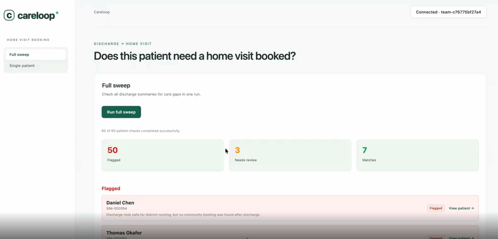

# Careloop

A hospital discharge note says a patient needs community follow-up care.
Nobody automatically checks whether that follow-up actually got booked.
Careloop does: for a given patient it reads their discharge summary from
NHS-SIM, uses an LLM agent to decide what kind of care the note is asking for,
reads what community services actually have booked, and flags a gap when the
two don't line up. When the gap is a missing home visit, a human can review a
drafted booking and confirm it with one click - Careloop books the visit and
texts the patient the date and time.

Careloop is a **review aid, not a clinical decision maker**.

## Built at the Anima × OpenAI hackathon

Careloop was built in a single 12-hour session at the Anima × OpenAI
hackathon in London on 12 September 2026. The brief was to build something
that materially advances the NHS 10 Year Health Plan, using Anima's NHS-SIM
neighbourhood simulator and their agent ADK. It works end-to-end against a
real simulator and a real OpenAI model, but the scope is deliberately narrow:
only home-visit gaps get an actionable booking flow, and every other
interaction with NHS-SIM stays read-only. All patient data is synthetic,
generated by NHS-SIM.



## How it works

For a given patient ID, Careloop:

1. Reads the patient's latest **filed** hospital discharge summary from
   NHS-SIM.
2. Passes the free-text sections to an LLM agent, which decides whether
   community follow-up care is needed and, if so, which single category best
   fits (of 8 - see `careTypes` in `dashboard/src/model.js`). The agent
   prefers flagging its own decision as ambiguous over guessing when the note
   doesn't say enough. The same call also writes a plain-language summary of
   the note and, only when the decided type is a home visit, drafts a
   booking title and handover note.
3. Reads what community services actually have booked for that patient and
   reconciles it against the decision: care needed but nothing booked
   (`flag`), a booking that doesn't match the decided type (`flag`), an
   ambiguous decision or an unverifiable match (`review`), or a match (`ok`).
4. **Only when the decision is home-visit, needed, unambiguous, and nothing
   matching is booked**, shows the drafted booking as an editable form. A
   human can edit it, then explicitly confirm to book it via NHS-SIM's
   `schedule_visit` action, or dismiss it. As part of that same confirmed
   click, Careloop also texts the patient the date and time via the GP
   site's messaging action.

A **full sweep** runs this check across every discharged patient at once (up
to twelve concurrently), grouped by outcome, so a reviewer can triage a whole
ward rather than checking patients one at a time.

Every other care type, and every other NHS-SIM interaction, stays read-only -
Careloop never books, cancels, or edits anything else, and never contacts a
patient outside of that one confirmed home-visit action.

## Getting started

```sh
npm install
cp .env.example .env   # then fill in SIM_API_KEY and OPENAI_API_KEY
npm run dev            # Vite dev server on :5173, Node API on :8000
```

Open http://localhost:5173. Both keys are read server-side only and are
never sent to the browser: `SIM_API_KEY` authenticates with NHS-SIM,
`OPENAI_API_KEY` runs the care-decision agent. If `SIM_API_KEY` is set,
Careloop connects automatically; otherwise it opens a dialog to paste a team
key by hand for that session.

If startup reports `EADDRINUSE`, another Careloop dev session already has
ports 5173 and 8000 - use that session or stop it first.

```sh
npm test            # domain-logic and server unit tests (node --test)
npm run build       # production frontend build (dashboard/dist)
npm start           # serve the built app at http://localhost:3000
```

Both the dev server and the production server bind to loopback only.

## Repository layout

```
dashboard/
  index.html      Vite HTML entrypoint
  style.css       Dashboard styling and responsive rules
  vite.config.js  Vite build config and dev proxy to the Node API
  server.js       Loopback-only Node server: static files, the NHS-SIM
                  proxy, and the one write route (book-home-visit)
  sweep.js        Concurrent multi-patient sweep and the decision cache
  careAgent.js    ADK agents: discharge decision and care-match verdict
  src/
    App.jsx       React UI - connect, single-patient check, full sweep
    model.js      Pure reconciliation rules and the care-type vocabulary
    sweep.css     Sweep-page and sidebar-nav styling
    main.jsx      React entrypoint
  *.test.js       Node test-runner suites (model, sweep, booking, discharges)
docs/
  screenshot.png  Dashboard screenshot used in this README
  flow.md         The call sequence, decision table, and error handling in detail
AGENTS.md         Conventions, NHS-SIM API notes, and guardrails for AI coding agents
```

## Tech stack

| Layer | Technology |
|---|---|
| Frontend | React 19 + Vite 7 |
| Backend | Node's built-in `http`, no framework |
| Agents | `@animahealth/adk`, an OpenAI model, structured output validated with zod |
| Domain logic | Framework-free JS in `dashboard/src/model.js` |

## Working with AI coding agents

This repo was built with, and is documented for, AI coding agents.
[`AGENTS.md`](./AGENTS.md) covers coding conventions, the NHS-SIM API
findings gathered during development, and the clinical-product guardrails
that apply to any change - read it before touching the decision or
reconciliation logic. [`docs/flow.md`](./docs/flow.md) has the full call
sequence and decision table if you need more detail than the summary above.

## License

MIT - see [LICENSE](./LICENSE).
